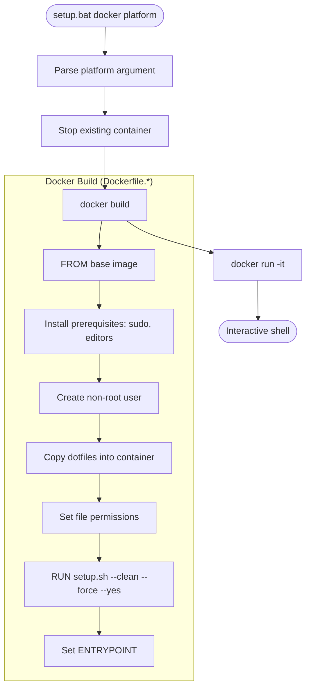
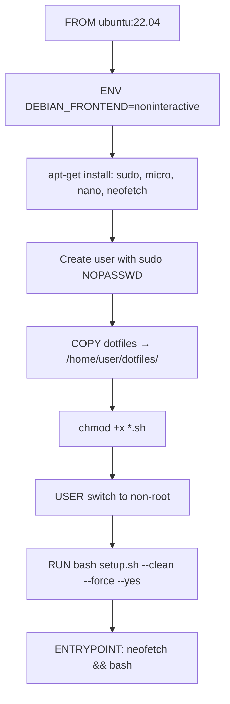
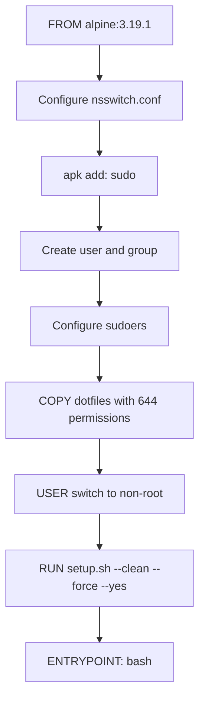
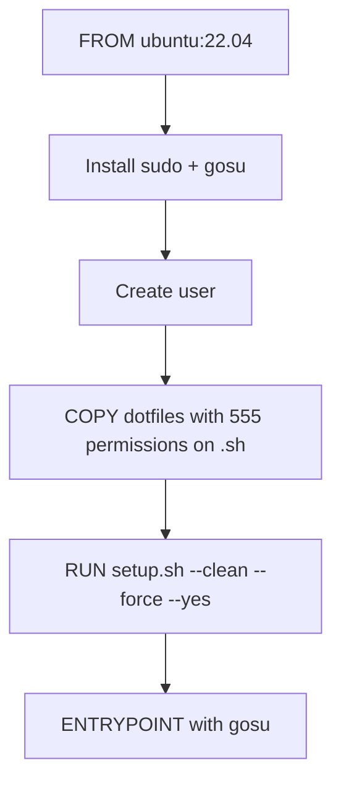
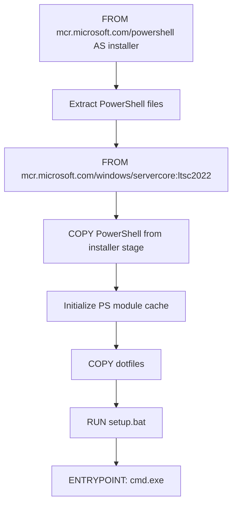
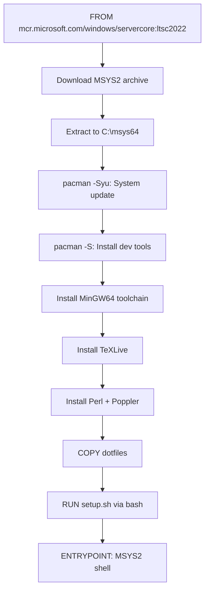
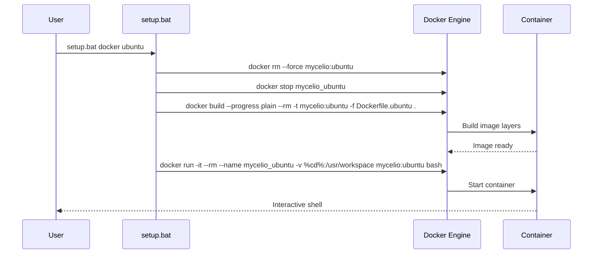
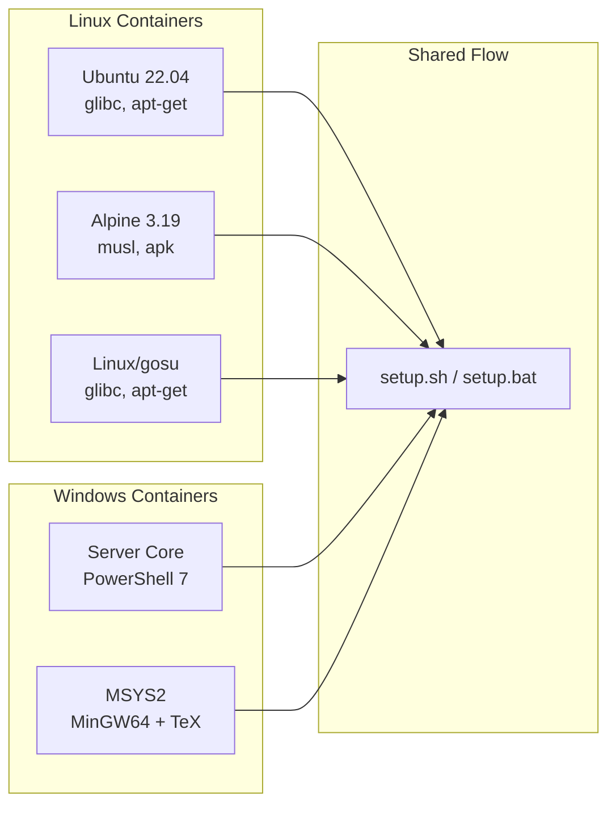

# Docker Setup Flow

Complete documentation of the Docker-based dotfiles setup for containerized testing
and development environments.

## Overview

The Docker setup provides isolated environments for testing dotfiles installation on
multiple platforms without affecting the host system. It supports five container targets.

## Supported Container Platforms

| Platform | Dockerfile | Base Image | Use Case |
|----------|-----------|------------|----------|
| Ubuntu | `Dockerfile.ubuntu` | ubuntu:22.04 | Primary Linux testing |
| Alpine | `Dockerfile.alpine` | alpine:3.19.1 | Minimal/musl testing |
| Linux | `Dockerfile.linux` | ubuntu:22.04 | Alternative with gosu |
| Windows | `Dockerfile.windows` | Windows Server Core ltsc2022 | Windows container testing |
| MSYS2 | `Dockerfile.msys2` | Windows Server Core ltsc2022 | MSYS2/MinGW build testing |

## Invocation

```batch
:: From setup.bat (Windows host)
setup.bat docker ubuntu
setup.bat docker alpine [optional-command]

:: Direct Docker commands
docker build -t mycelio:ubuntu -f source/docker/Dockerfile.ubuntu .
docker run -it --rm mycelio:ubuntu
```

## High-Level Flow



---

## Platform-Specific Details

### Ubuntu Container (Dockerfile.ubuntu)



**Build steps:**
1. Base image: `ubuntu:22.04`
2. Set `DEBIAN_FRONTEND=noninteractive` (suppress prompts)
3. Install minimal packages: `sudo`, `micro`, `nano`, `neofetch`
4. Create user:
   - Username from build arg (default: `user`)
   - Disabled password (`passwd -d`)
   - Added to sudo group
   - `NOPASSWD:ALL` in sudoers
5. Copy full dotfiles repository into `/home/$USERNAME/dotfiles/`
6. Set execute permissions on all `.sh` files
7. Switch to non-root user
8. Run full setup: `bash /dotfiles/setup.sh --clean --force --yes`
9. Entry point: display neofetch + bash shell

**Safety:** ⚠️ **Medium Risk**
- `NOPASSWD:ALL` in sudoers (acceptable for dev containers)
- Full repository copy includes potentially sensitive files
- `--force --yes` bypasses all safety prompts

**Improvement suggestions:**
- Use `.dockerignore` to exclude `.git/`, `artifacts/`, sensitive files
- Pin base image hash for reproducibility (`ubuntu:22.04@sha256:...`)
- Use multi-stage build to reduce final image size
- Add health check
- Consider non-root final image without sudo access

---

### Alpine Container (Dockerfile.alpine)



**Build steps:**
1. Base image: `alpine:3.19.1`
2. Configure `/etc/nsswitch.conf` for DNS resolution
3. Install `sudo` via apk
4. Create group and user with home directory
5. Configure `NOPASSWD:ALL` sudoers
6. Copy dotfiles with `--chmod=644`
7. Switch user and run setup

**Unique considerations:**
- Alpine uses musl libc (not glibc) — some tools may not work
- Minimal base (5MB) — most tools must be explicitly installed
- `nsswitch.conf` needed for proper DNS in containers
- bash is not pre-installed (setup.sh handles this)

**Safety:** ✅ **Low Risk** (isolated container)

**Improvement suggestions:**
- Add `--no-cache` to apk operations to reduce layer size
- Consider `alpine:edge` for newer package versions
- Test musl compatibility for all installed tools
- Document which tools may fail on Alpine

---

### Linux Container (Dockerfile.linux)



**Differences from Ubuntu variant:**
- Installs `gosu` for user switching in entrypoint scripts
- File permissions set to `555` (read+execute) for `.sh` files
- Designed for use cases where entrypoint needs to drop privileges

**Safety:** ✅ **Low Risk** (isolated container)

**Improvement suggestions:**
- Document when to use this vs the Ubuntu variant
- Verify gosu binary signature during installation
- Consider using Docker's `--user` flag instead of gosu

---

### Windows Container (Dockerfile.windows)



**Multi-stage build:**
1. **Stage 1 (installer):** Extract PowerShell 7 from official image
2. **Stage 2 (runtime):** Windows Server Core with:
   - PowerShell 7 copied from stage 1
   - Module cache initialized
   - Dotfiles copied and setup.bat executed

**Unique considerations:**
- Windows containers require Windows host (or Hyper-V isolation)
- Server Core lacks many standard tools (Robocopy handled by setup.bat)
- PowerShell must be manually bootstrapped
- Image size is large (5GB+ for Server Core)

**Safety:** ⚠️ **Medium Risk**
- Registry modifications happen inside container
- Entire setup.bat flow runs (including AutoRun registry)
- Container is ephemeral, so registry changes don't persist

**Improvement suggestions:**
- Use Nano Server for smaller image where possible
- Skip AutoRun registry setup in container context
- Add container detection to skip unnecessary host-specific steps
- Consider Windows Container App Isolation for better security

---

### MSYS2 Container (Dockerfile.msys2)



**Packages installed via pacman:**
- `msys2-devel`, `base-devel` (build essentials)
- `git`, `autoconf`, `automake`, `libtool`
- MinGW64: `make`, `gcc`, `binutils`
- `texlive` (full TeX distribution for docs)
- `perl`, `poppler` (PDF tools)

**Unique considerations:**
- Used for building Stow documentation (man pages, PDF)
- Full MinGW64 toolchain for native Windows binary compilation
- TeXLive is large (1GB+) — only needed for documentation builds
- MSYS2 provides Unix-like environment on Windows

**Safety:** ✅ **Low Risk** (isolated container, build-focused)

**Improvement suggestions:**
- Make TeXLive optional (separate build stage or argument)
- Cache pacman packages across builds
- Use specific MSYS2 archive version (not latest)
- Split into build and runtime stages

---

## Docker Invocation from setup.bat



**Key flags:**
- `--progress plain` — Full build output (no fancy progress bars)
- `--rm` — Remove image layers after build
- `-it` — Interactive with TTY
- `--rm` (run) — Remove container on exit
- `-v %cd%:/usr/workspace` — Mount host dotfiles as volume

**Safety:** ⚠️ **Low-Medium Risk**
- Force-removes existing containers without confirmation
- Volume mount exposes host filesystem to container
- Container has network access during build

**Improvement suggestions:**
- Add `--no-cache` option for clean builds
- Use read-only volume mount (`:ro`) where possible
- Add build timeout
- Support `--build-arg` for customization
- Add `docker compose` support for multi-container testing

---

## Security Audit Summary

| Aspect | Risk | Notes |
|--------|------|-------|
| Base image provenance | Low | Official images from Docker Hub / MCR |
| NOPASSWD sudo | Medium | Acceptable for dev containers; avoid in production |
| Network during build | Low | Standard package manager HTTPS connections |
| Volume mounts | Medium | Host filesystem accessible from container |
| Force container removal | Low | Only affects dotfiles containers |
| Credential exposure | Low | No secrets copied (unless in dotfiles repo) |
| Image pinning | Medium | Tags can change; use SHA256 digests |

---

## Build Matrix



---

## Optimization Recommendations

### Image Size Reduction

| Container | Current Size (est.) | Potential Savings |
|-----------|-------------------|-------------------|
| Ubuntu | ~1.5GB | Multi-stage: ~800MB |
| Alpine | ~500MB | Already minimal |
| Windows | ~6GB | Nano Server: ~2GB |
| MSYS2 | ~8GB | Remove TeXLive: ~4GB |

### Build Time Reduction

1. **Layer caching:** Order Dockerfile commands from least to most frequently changing
2. **Package caching:** Mount package manager cache as Docker volume
3. **Multi-stage builds:** Separate build dependencies from runtime
4. **Parallel builds:** Use `docker buildx bake` for concurrent platform builds

### CI Integration

```yaml
# Example GitHub Actions matrix
strategy:
  matrix:
    platform: [ubuntu, alpine, linux]
steps:
  - run: docker build -t mycelio:${{ matrix.platform }} -f source/docker/Dockerfile.${{ matrix.platform }} .
  - run: docker run --rm mycelio:${{ matrix.platform }} bash -c "cd dotfiles && bats test/"
```

**Improvement suggestions:**
- Add GitHub Actions workflow for automated container testing
- Use Docker layer caching in CI (`actions/cache`)
- Run BATS tests inside containers as validation
- Push tested images to container registry for reuse
- Add container scanning (Trivy, Snyk) for vulnerability detection
