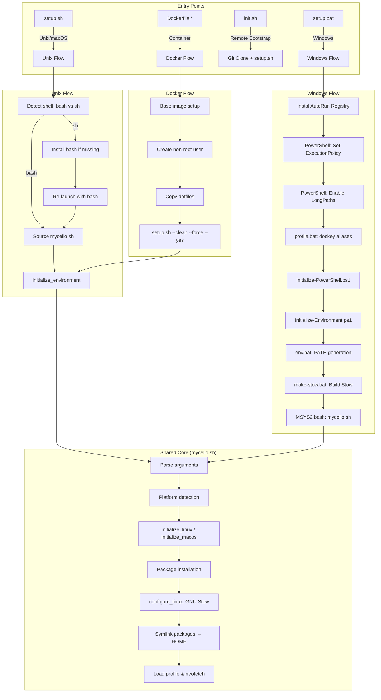
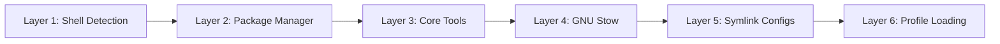
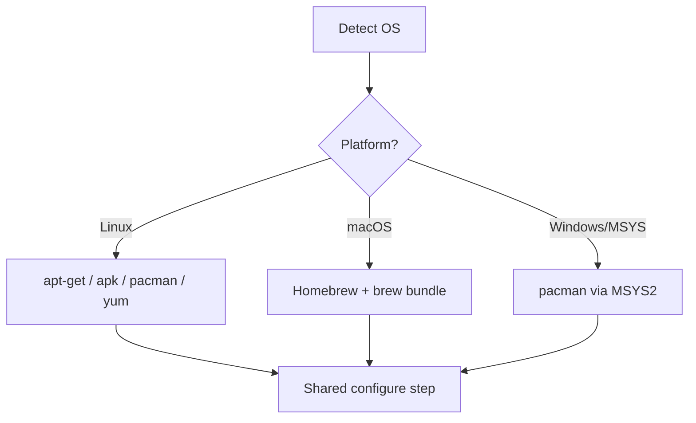

# Dotfiles Setup Flow — Overview

This document provides a high-level overview of the dotfiles setup system across all
supported platforms, including entry points, shared architecture, and cross-platform
design decisions.

## Supported Platforms

| Platform | Entry Point | Shell | Key Dependencies |
|----------|------------|-------|------------------|
| Windows (native) | `setup.bat` | cmd.exe → PowerShell → MSYS2/bash | Scoop, Perl, MSYS2 |
| Linux (Ubuntu/Debian) | `setup.sh` | bash | apt-get, GNU Stow, Perl |
| Linux (Alpine) | `setup.sh` | sh → bash | apk, GNU Stow, Perl |
| macOS | `setup.sh` | bash | Homebrew, GNU Stow, Perl |
| Docker (any) | `Dockerfile.*` → `setup.sh` | bash | Platform package manager |
| WSL (from Windows) | `setup.bat wsl` | bash (via WSL) | Same as Linux |

## Architecture Diagram



## Core Design Principles

### 1. Single Source of Truth

All Unix-like initialization logic lives in `source/bin/mycelio.sh` (~2400 lines).
Windows setup orchestrates PowerShell and then hands off to the same `mycelio.sh`
via MSYS2's bash environment. This ensures consistent behavior across platforms.

### 2. Idempotent Execution

The setup is designed to be run multiple times safely:

- Commands check for existing installations before installing
- Registry keys are checked before being created/modified
- Symlinks are validated before creation
- `--force` flag overrides these checks when needed

### 3. Layered Bootstrap



Each layer depends on the previous one being complete. If a layer fails, subsequent
layers are skipped with appropriate error messages.

### 4. Platform-Aware Execution



### 5. CI/CD Integration

The system detects GitHub Actions and adapts output formatting:

- `::group::` / `::endgroup::` for collapsible log sections
- `::error::` for error annotations
- `[command]` prefix for command echo (matching Azure DevOps style)
- `--yes` flag for fully non-interactive operation

## Environment Variables

| Variable | Purpose | Set By |
|----------|---------|--------|
| `MYCELIO_ROOT` | Dotfiles repository root | All entry points |
| `MYCELIO_HOME` | User home directory | mycelio.sh |
| `MYCELIO_OS` | Operating system (linux/darwin/windows) | mycelio.sh |
| `MYCELIO_ARCH` | CPU architecture (amd64/arm64/arm/386) | mycelio.sh |
| `MYCELIO_SHELL` | Shell name and version | mycelio.sh |
| `MYCELIO_TEMP` | Temporary directory ($HOME/.tmp) | mycelio.sh |
| `MYCELIO_INTERACTIVE` | Is terminal interactive (0/1) | mycelio.sh |
| `MYCELIO_ARG_CLEAN` | Clean flag parsed | mycelio.sh |
| `MYCELIO_ARG_FORCE` | Force flag parsed | mycelio.sh |
| `MYCELIO_ARG_DEBUG` | Debug flag parsed | mycelio.sh |
| `MYCELIO_PROFILE_INITIALIZED` | Windows profile loaded | profile.bat |
| `PERL5LIB` | Perl module search path | make-stow / mycelio.sh |

## Command-Line Arguments

```
setup.sh [OPTIONS] [COMMAND]
setup.bat [OPTIONS] [COMMAND]

OPTIONS:
  -c, --clean     Remove temp files and rebuild everything
  -f, --force     Force operation even if checks fail
  -d, --debug     Enable bash -x trace output to log file
  -y, --yes       Non-interactive mode (no prompts)
  -h, --home PATH Override home directory path

COMMANDS:
  docker <platform>   Build and run Docker container (ubuntu/alpine/linux/windows/msys2)
  wsl [WSL-ARGS]      Execute setup inside WSL (Windows only)
```

## File Organization

```
dotfiles/
├── setup.bat                          # Windows entry point
├── setup.sh                           # Unix/macOS entry point
├── source/
│   ├── bin/
│   │   ├── mycelio.sh                 # Core library (2400+ lines)
│   │   ├── init.sh                    # Remote bootstrap (curl | bash)
│   │   ├── init.bat                   # Windows quick-start
│   │   ├── init.ps1                   # PowerShell quick-start
│   │   └── provision.sh               # Server provisioning
│   ├── powershell/
│   │   ├── Initialize-PowerShell.ps1  # PS module installation
│   │   ├── Initialize-Environment.ps1 # Windows tool installation
│   │   ├── Write-EnvironmentSetup.ps1 # PATH generator
│   │   ├── Profile.ps1               # PowerShell $PROFILE
│   │   └── Invoke-CmdScript.ps1      # cmd→PS env bridge
│   ├── windows/bin/
│   │   ├── profile.bat               # cmd.exe AutoRun script
│   │   ├── env.bat                    # Environment loader
│   │   └── *.bat                      # Utility shims
│   ├── stow/
│   │   └── tools/make-stow.bat       # Build Stow on Windows
│   ├── docker/
│   │   └── Dockerfile.*              # Container definitions
│   └── provisioning/
│       ├── setup.sh                   # Ubuntu VM provisioning
│       └── upgrade.sh                 # Ubuntu release upgrade
├── packages/                          # Stow packages (→ $HOME)
│   ├── shell/                         # .profile, .bashrc, .zshrc, etc.
│   ├── vim/                           # .vimrc, .vim/
│   ├── fish/                          # Fish shell config
│   ├── fonts/                         # Font files
│   ├── macos/                         # macOS-specific
│   └── windows/                       # Windows-specific
└── test/                              # BATS test suite
    ├── test_base.bats
    ├── test_error_handling.bats
    └── test_realpath.bats
```

## Related Documentation

- [Windows Setup Flow](setup-flow-windows.md) — Detailed Windows-specific walkthrough
- [Unix/macOS Setup Flow](setup-flow-unix.md) — Detailed Unix/macOS walkthrough
- [Docker Setup Flow](setup-flow-docker.md) — Container build and runtime details
