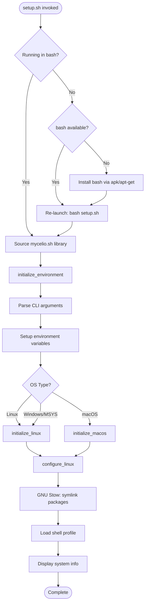
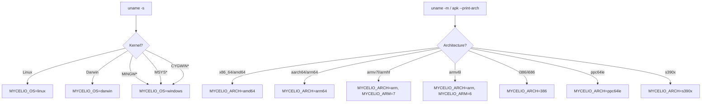
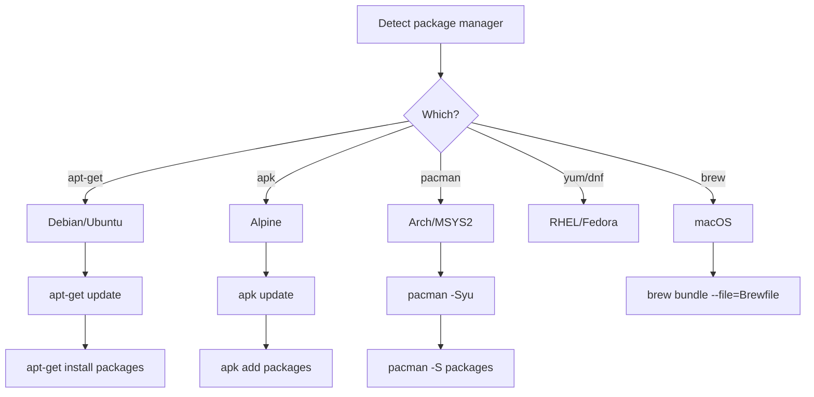
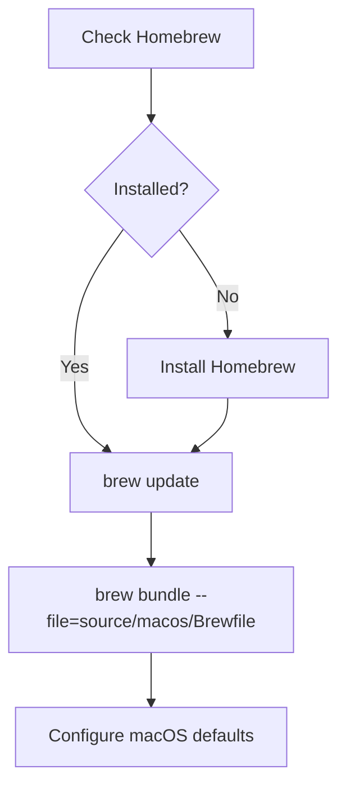
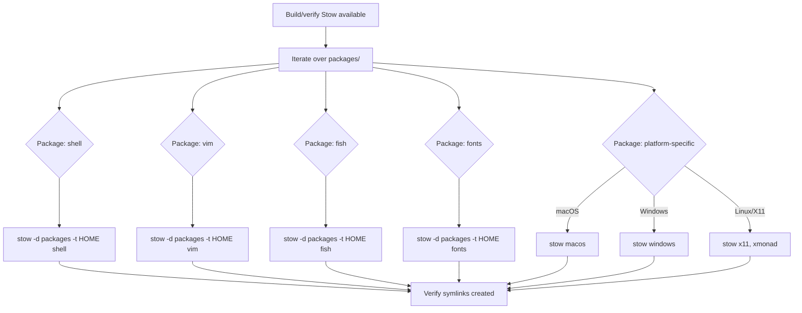
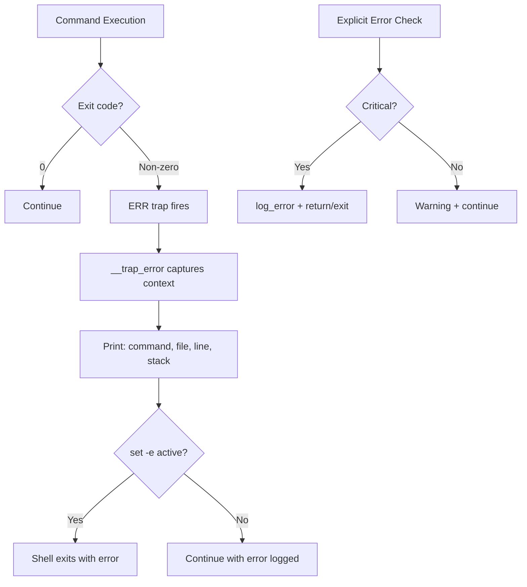

# Unix/macOS Setup Flow

Complete documentation of the Unix/Linux/macOS dotfiles setup process triggered by `setup.sh`.

## High-Level Flow



## Entry Point: setup.sh

### Shell Bootstrap Logic

```mermaid
flowchart TD
    A[/bin/sh runs setup.sh] --> B{BASH_VERSION set?}
    B -->|Yes| C[Use BASH_SOURCE for path resolution]
    B -->|No| D[Use $0 for path resolution]
    C --> E[Source mycelio.sh directly]
    D --> F{command -v bash?}
    F -->|Yes| G[bash setup.sh -- re-exec]
    F -->|No| H{command -v apk?}
    H -->|Yes| I[sudo apk update && apk add bash]
    H -->|No| J{command -v apt-get?}
    J -->|Yes| K[sudo apt-get install bash]
    J -->|No| L[Fail: no bash available]
    I --> G
    K --> G
    G --> E
```

**Safety:** ✅ **Low Risk**
- Uses `set -eu` (strict mode: exit on error, undefined variables)
- The `_use_sudo()` helper conditionally uses sudo (skips on Cygwin/MSYS)
- Path resolution via custom `_get_real_path()` handles missing `realpath`

**Improvement suggestions:**
- Add explicit minimum bash version check (e.g., bash 4.0+)
- Provide better error message if bash installation fails
- Consider supporting zsh as an alternative execution shell

---

## Core Library: source/bin/mycelio.sh

This is the ~2400-line shared library that orchestrates the entire Unix setup.

### Step 1: Error Handling Setup

**What it does:** Installs error traps for debugging and clean failure reporting.

```bash
trap '__trap_error $? "${BASH_COMMAND}" "${BASH_SOURCE[0]}" "${LINENO}" "${FUNCNAME[*]}"' ERR
```

**Features:**
- `__trap_error()` — Captures exit code, failed command, source file, line number, and call stack
- `__print_stack()` — Prints function call stack (bash only)
- `__safe_exit()` — Validates exit codes before exit
- `_remove_error_handling()` — Removes traps on successful completion

**Safety:** ✅ **Safe** — Diagnostic only

**Improvement suggestions:**
- Write error details to a log file (not just stdout)
- Include timestamp in error output
- Add structured error codes for programmatic handling

---

### Step 2: Platform Detection

**What it does:** Determines OS, architecture, and shell capabilities.



**Detection variables set:**
| Variable | Example Values | Source |
|----------|---------------|--------|
| `MYCELIO_OS` | linux, darwin, windows | `uname -s` |
| `MYCELIO_ARCH` | amd64, arm64, arm, 386 | `uname -m` / `apk --print-arch` |
| `MYCELIO_ARM` | 6, 7 | ARM variant detection |
| `MYCELIO_SHELL` | bash v5.1.16, zsh v5.8 | `$BASH_VERSION` / `$ZSH_VERSION` |

**Safety:** ✅ **Safe** — Read-only detection

**Improvement suggestions:**
- Add detection for WSL2 vs native Linux
- Detect container runtime (Docker, Podman, LXC)
- Cache detection results for subsequent calls

---

### Step 3: Argument Parsing

**What it does:** Parses CLI flags and sets global state variables.

```bash
_parse_arguments() {
    while [ $# -gt 0 ]; do
        case "$1" in
            -c|--clean) MYCELIO_ARG_CLEAN=1 ;;
            -f|--force) MYCELIO_ARG_FORCE=1 ;;
            -d|--debug) MYCELIO_ARG_DEBUG=1 ;;
            -y|--yes)   MYCELIO_INTERACTIVE=0 ;;
            -h|--home)  shift; MYCELIO_HOME="$1" ;;
        esac
        shift
    done
}
```

**Safety:** ✅ **Safe** — Read-only parsing

**Improvement suggestions:**
- Add `--help` output
- Validate `--home` path exists
- Add `--verbose` / `--quiet` levels
- Support `--packages` to select which stow packages to install

---

### Step 4: Environment Setup

**What it does:** Initializes directory structure and git configuration.

**Operations:**
1. Create `$MYCELIO_TEMP` directory (`$HOME/.tmp`)
2. Create `$HOME/.local/bin` directory
3. Configure git globals (if git available):
   - `core.symlinks = true`
   - `core.autocrlf = input` (Unix) or `true` (Windows)
   - `pull.rebase = false`
4. Debug trace setup (if `--debug`):
   - Creates `$HOME/.logs/` directory
   - Redirects bash -x output to timestamped log file

**Safety:** ✅ **Low Risk**
- Creates directories in user space only
- Git config is user-scoped (`--global`)

**Improvement suggestions:**
- Check if git config values differ before setting
- Support XDG_CONFIG_HOME for directory locations
- Make temp directory location configurable

---

### Step 5: initialize_linux() — Package Installation

**What it does:** Installs system packages using the detected package manager.



**Packages installed (common subset):**

| Category | Packages |
|----------|----------|
| Core | bash, coreutils, findutils, grep, sed, gawk |
| VCS | git, git-lfs |
| Build | gcc, g++, make, autoconf, automake, libtool, pkg-config |
| Network | curl, wget, openssh-client, rsync |
| Text | vim, nano, less, tree |
| Perl | perl, cpanminus, liblocal-lib-perl |
| Python | python3, python3-pip |
| Shell | tmux, htop, shellcheck, fish |
| Fonts | fontconfig |
| Docs | texlive (optional), pandoc |

**Safety:** ⚠️ **Medium Risk**
- Uses sudo for system-wide package installation
- Downloads from distribution mirrors (network dependency)
- Large number of packages may conflict with existing installations
- Version conflicts possible with manually-installed software

**Improvement suggestions:**
- Make package lists configurable (minimal vs full)
- Check for package conflicts before installing
- Support `--no-install` flag for environments with pre-installed packages
- Pin package versions for reproducibility in CI
- Add retry logic with backoff for mirror failures
- Log installed package versions for auditing

---

### Step 6: initialize_macos() — macOS-Specific Setup

**What it does:** Uses Homebrew and brew bundle for macOS package management.



**Brewfile contents:** Defines taps, brews, and casks for macOS development tools.

**Safety:** ⚠️ **Medium Risk**
- Homebrew installation runs a remote script
- `brew bundle` may install GUI applications (casks)
- macOS defaults changes persist across reboots

**Improvement suggestions:**
- Separate CLI tools from GUI applications in Brewfile
- Add `--cask` / `--no-cask` flag
- Verify Homebrew script hash before running
- Make macOS defaults changes optional

---

### Step 7: configure_linux() — GNU Stow Operations

**What it does:** Uses GNU Stow to create symlinks from `packages/` directories into `$HOME`.



**Stow packages mapped:**

| Package | Contents | Target |
|---------|----------|--------|
| `shell` | .profile, .bashrc, .bash_aliases, .zshrc, .inputrc | `$HOME/` |
| `vim` | .vimrc, .vim/ directory | `$HOME/` |
| `fish` | .config/fish/ | `$HOME/` |
| `fonts` | Font files | `$HOME/.local/share/fonts/` |
| `x11` | .Xresources, etc. | `$HOME/` |
| `xmonad` | .xmonad/ | `$HOME/` |
| `macos` | macOS preferences | `$HOME/` |
| `windows` | Windows configs | `$HOME/` |
| `sublime` | Sublime Text settings | `$HOME/` |

**Safety:** ⚠️ **Medium Risk**
- Creates/overwrites symlinks in HOME directory
- Existing files may be replaced (data loss if not committed)
- Broken symlinks if repository moves
- `.stow-local-ignore` controls what gets linked

**Improvement suggestions:**
- Dry-run before actual stow (show what would change)
- Backup existing files before creating symlinks
- Add `--packages` flag to select specific packages
- Validate symlink targets exist after stow
- Report conflicts clearly (which files would be overwritten)
- Support `unstow` command for clean removal

---

### Step 8: Profile Loading

**What it does:** Sources the newly-created shell profile to verify it works.

```bash
_load_profile() {
    if [ -f "$HOME/.profile" ]; then
        . "$HOME/.profile"
    fi
    if [ -f "$HOME/.bashrc" ]; then
        . "$HOME/.bashrc"
    fi
}
```

**Safety:** ✅ **Low Risk**
- Only sources files that were just created/linked
- Runs in current shell context

**Improvement suggestions:**
- Validate profile doesn't contain errors before sourcing
- Capture and report any errors from sourcing
- Skip if running non-interactively

---

### Step 9: Display System Info

**What it does:** Runs `neofetch` (if available) to display system information.

**Safety:** ✅ **Safe** — Read-only display

**Improvement suggestions:**
- Skip in CI/non-interactive mode
- Use fallback if neofetch not installed

---

## Utility Functions Reference

### Execution Helpers

| Function | Purpose | Sudo |
|----------|---------|------|
| `run_command()` | Execute with logging, capture stdout/stderr | No |
| `run_command_sudo()` | Execute with conditional sudo | Yes |
| `task_group()` | Group operations (GitHub Actions collapse) | No |
| `run_task()` | Named task with group wrapper | No |
| `run_task_sudo()` | Named task with sudo | Yes |
| `get_file()` | Download file via wget/curl | No |
| `_timeout()` | Cross-platform timeout wrapper | No |

### Detection Helpers

| Function | Purpose |
|----------|---------|
| `_command_exists()` | Check if command is on PATH |
| `_is_windows()` | Detect MSYS/Cygwin/MINGW |
| `_has_admin_rights()` | Check if sudo requires password |
| `_allow_sudo()` | Can sudo be used non-interactively |
| `_get_windows_root()` | Map Windows paths from WSL/MSYS |
| `_get_real_path()` | Cross-platform realpath |

### Stow Helpers

| Function | Purpose |
|----------|---------|
| `_stow_internal()` | Core stow invocation with error handling |
| `_stow_packages()` | Iterate and stow all packages |
| `_build_stow()` | Build Stow from source if not available |

---

## Error Handling Architecture



**Error output format (CI):**
```
::error file=source/bin/mycelio.sh,line=1234::Command 'stow' failed with exit code 1
```

**Error output format (local):**
```
[mycelio] ERROR: Command 'stow' failed with exit code 1
  → source/bin/mycelio.sh:1234 in configure_linux()
  → source/bin/mycelio.sh:890 in initialize_environment()
  → setup.sh:78 in setup()
```

---

## Security Audit Summary

| Step | Risk Level | Requires sudo | Network | Modifies HOME |
|------|-----------|--------------|---------|---------------|
| Shell bootstrap | Low | Conditional | Conditional | No |
| Platform detection | None | No | No | No |
| Argument parsing | None | No | No | No |
| Environment setup | Low | No | No | Creates dirs |
| Package installation | **Medium** | **Yes** | **Yes** | No |
| macOS setup | Medium | Conditional | **Yes** | No |
| GNU Stow | Medium | No | No | **Yes** |
| Profile loading | Low | No | No | No |
| System info | None | No | No | No |

### Key Security Considerations

1. **sudo usage:** Only for package installation; `_allow_sudo()` checks if non-interactive sudo is possible
2. **Network downloads:** Package managers use HTTPS; `get_file()` uses curl/wget (HTTPS)
3. **Symlink creation:** Stow validates paths but could overwrite existing files
4. **Remote bootstrap risk:** `init.sh` is designed for `curl | bash` — inherent MITM risk

---

## Platform-Specific Behavior Matrix

| Behavior | Ubuntu/Debian | Alpine | Arch/MSYS2 | macOS |
|----------|--------------|--------|------------|-------|
| Package manager | apt-get | apk | pacman | brew |
| Sudo available | Yes | Yes | Conditional | Yes |
| Shell default | bash | sh (installs bash) | bash | zsh |
| Stow source | Package or build | Build from source | Package | brew |
| Fonts | fontconfig | fontconfig | N/A | Font Book |
| Symlinks | Native | Native | MSYS emulation | Native |

---

## Timing Expectations

| Step | Typical Duration | Notes |
|------|-----------------|-------|
| Shell bootstrap | < 2s | Instant if bash available |
| Platform detection | < 1s | Local commands only |
| Package installation | 1–10min | Network + package count dependent |
| macOS brew bundle | 2–15min | Cask downloads can be large |
| GNU Stow operations | < 30s | Fast symlink creation |
| Profile loading | < 1s | Sources shell files |
| **Total (first run)** | **3–25min** | Highly network-dependent |
| **Total (subsequent)** | **30s–2min** | Most packages already installed |
