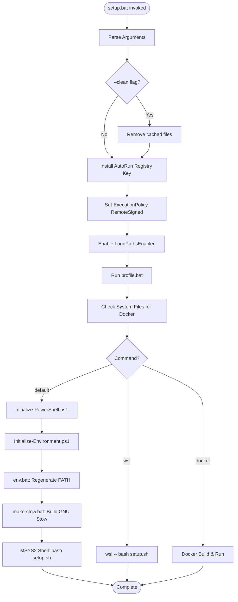
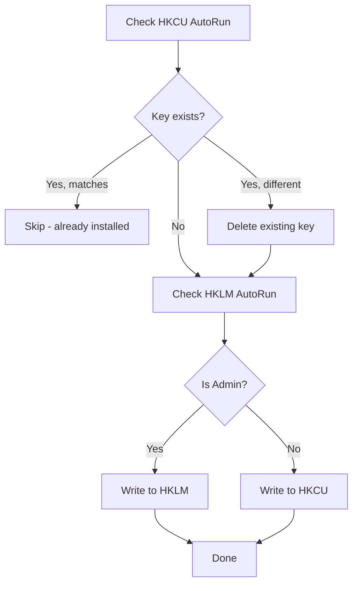
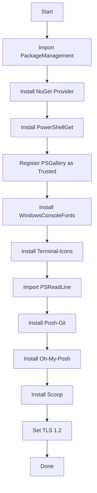
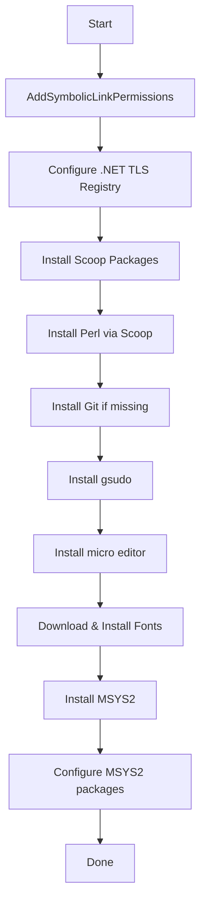
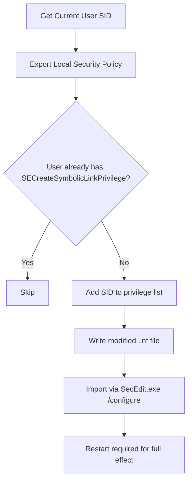
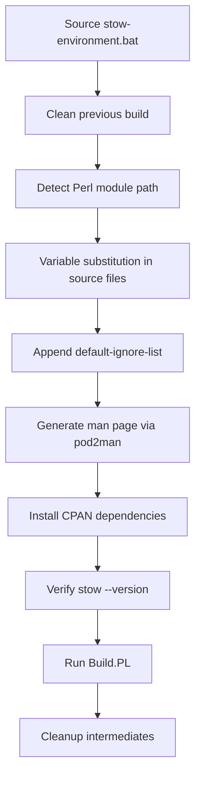

# Windows Setup Flow

Complete documentation of the Windows dotfiles setup process triggered by `setup.bat`.

## High-Level Flow



## Detailed Step Breakdown

---

### Step 1: Argument Parsing

**What it does:** Processes command-line arguments to determine execution mode.

**Supported arguments:**
- `docker <platform>` — Build and launch Docker container
- `wsl [args]` — Execute setup inside WSL
- `-c` / `--clean` / `clean` / `cls` — Remove cached artifacts
- Other args passed through to downstream scripts

**Safety:** ✅ Safe — Read-only parsing of command line

**Improvement suggestions:**
- Add `--help` / `-h` flag to display usage information
- Validate `docker` platform argument against known values (ubuntu, alpine, linux, windows, msys2)
- Add `--dry-run` flag to preview operations without executing

---

### Step 2: Clean Operation (Conditional)

**What it does:** Removes generated/cached files to force a fresh build.

**Files/directories removed:**
| Target | Purpose |
|--------|---------|
| `%USERPROFILE%\.local\msys64` | Entire MSYS2 installation |
| `%USERPROFILE%\.tmp` | User temp directory |
| `%MYCELIO_ROOT%\.tmp` | Project temp directory |
| `source\stow\bin\stow` | Built Stow script |
| `source\stow\bin\chkstow` | Built chkstow script |
| `%USERPROFILE%\Documents\PowerShell` | PS Core profile |
| `%USERPROFILE%\Documents\WindowsPowerShell` | PS Desktop profile |

**Safety:** ⚠️ **Medium Risk**
- Deletes MSYS2 (large download to re-acquire)
- Deletes PowerShell profile directories (may contain user customizations)
- Uses `rmdir /s /q` which does not prompt

**Improvement suggestions:**
- Back up user-modified files before deletion
- Log what was deleted and file sizes for audit
- Add confirmation prompt unless `--yes` is also passed
- Consider selective clean (e.g., `--clean-msys`, `--clean-ps`)

---

### Step 3: Install AutoRun Registry Key

**What it does:** Registers `source\windows\bin\profile.bat` as the AutoRun command
for cmd.exe. This ensures the dotfiles environment is loaded in every new cmd.exe window.



**Registry locations:**
- `HKCU\Software\Microsoft\Command Processor\AutoRun` (current user)
- `HKLM\Software\Microsoft\Command Processor\AutoRun` (all users, requires admin)

**Value set:** Full path to `profile.bat`

**Safety:** ⚠️ **Medium-High Risk**
- Modifies Windows registry
- Replaces any existing AutoRun value (could break other tools like clink)
- HKLM modification affects all users on the system
- Runs on **every** cmd.exe launch (performance sensitive)

**Improvement suggestions:**
- Append to existing AutoRun rather than replacing (support coexistence with clink)
- Add registry backup before modification
- Prefer HKCU over HKLM even when admin (principle of least privilege)
- Add an uninstall/remove option to cleanly undo
- Log the previous AutoRun value for recovery

---

### Step 4: Set-ExecutionPolicy RemoteSigned

**What it does:** Configures PowerShell to allow running local scripts while requiring
remote scripts to be signed.

```batch
powershell -NoLogo -NoProfile -Command "Set-ExecutionPolicy RemoteSigned -scope CurrentUser"
```

**Safety:** ✅ **Low Risk**
- Scoped to CurrentUser (not machine-wide)
- RemoteSigned is a reasonable security posture
- Standard practice for development environments

**Improvement suggestions:**
- Check current policy first; skip if already set
- Consider `Bypass` only within the setup script context rather than permanently changing policy

---

### Step 5: Enable Long Paths

**What it does:** Enables Windows long path support (>260 characters) via registry.

```batch
sudo powershell -Command "Set-ItemProperty 'HKLM:\SYSTEM\CurrentControlSet\Control\FileSystem' -Name 'LongPathsEnabled' -Value 1"
```

**Safety:** ⚠️ **Medium Risk**
- Requires administrator elevation (uses `sudo`)
- System-wide registry change
- Generally beneficial but may expose edge cases in older software
- Persists across reboots

**Improvement suggestions:**
- Check if already enabled before modifying
- Log that elevation was required
- Note this requires Windows 10 1607+ or Windows Server 2016+

---

### Step 6: Run profile.bat

**What it does:** Sources the environment profile to set up doskey aliases, PATH
modifications, and MYCELIO_* variables.

**Key operations:**
1. Detects nested shell invocations (skips in loops)
2. Loads `env.bat` (which generates PATH)
3. Sets doskey macros:
   - `cd.` → cd to MYCELIO_ROOT
   - `cd~` → cd to HOME
   - `cp` → copy, `mv` → move
   - `ls` → dir, `cat` → type
   - `edit` → micro.exe
   - `refresh` → re-source profile
4. Prints Unicode startup logo
5. Measures startup time

**Safety:** ✅ **Low Risk**
- Only sets environment variables and aliases
- Performance-sensitive (runs on every cmd.exe)
- Unicode logo requires UTF-8 terminal

**Improvement suggestions:**
- Add a `MYCELIO_QUIET` flag to suppress logo in scripts
- Cache the startup time measurement (avoid per-shell overhead)
- Consider lazy-loading aliases only when interactive

---

### Step 7: Check System Files (Docker Compatibility)

**What it does:** Ensures critical Windows system files exist, supporting Docker
Nano Server containers that lack certain executables.

**Files checked:**
- `Robocopy.exe`
- `msiexec.exe`
- `msi.dll`

**Logic:**
1. If running on host: copy system files to `artifacts\windows\` for Docker builds
2. If running in container: copy from `artifacts\windows\` to `C:\Windows\System32\`

**Safety:** ✅ **Low Risk** (on host) / ⚠️ **Medium Risk** (in container)
- Writing to System32 in containers is intentional but unusual
- Only copies if files are missing

**Improvement suggestions:**
- Verify file integrity (hash check) after copy
- Log which files were deployed and why
- Consider using Docker multi-stage builds instead

---

### Step 8: Initialize-PowerShell.ps1

**What it does:** Installs PowerShell modules and package management infrastructure.



**Safety:** ⚠️ **Medium Risk**
- Downloads and installs software from the internet (PSGallery, Scoop)
- Sets PSGallery as Trusted (future installs won't prompt)
- Scoop installation runs a remote script
- Module versions are not pinned

**Improvement suggestions:**
- Pin module versions for reproducibility
- Verify PSGallery package signatures
- Add retry logic for network failures
- Make Scoop installation optional (not all users want it)
- Add a manifest/lockfile for installed modules

---

### Step 9: Initialize-Environment.ps1

**What it does:** The most complex Windows step — installs development tools and
configures system permissions.



#### Sub-step: AddSymbolicLinkPermissions



**Safety:** 🔴 **High Risk**
- Modifies Local Security Policy (system-wide)
- Requires administrator elevation
- Changes persist across reboots
- Incorrect modification could lock out users
- Uses temp files for security policy (potential TOCTOU vulnerability)

**Improvement suggestions:**
- Check if privilege already granted before modifying
- Create a security policy backup file
- Validate the generated .inf file before applying
- Clean up temp files containing security policy data
- Add rollback capability
- Consider using Developer Mode instead (Windows 10 1703+), which grants symlink without policy changes

#### Sub-step: Font Installation

Downloads JetBrains Mono Nerd Font from GitHub releases and installs system-wide.

**Safety:** ⚠️ **Medium Risk**
- Downloads from GitHub (network dependency)
- Writes to Windows Fonts directory (requires elevation in some cases)
- No signature verification on downloaded files

**Improvement suggestions:**
- Verify SHA256 hash of downloaded font archive
- Support offline/cached font installation
- Make font installation optional

#### Sub-step: MSYS2 Installation

Downloads and configures a full MSYS2 environment with MINGW64 toolchain.

**Safety:** ⚠️ **Medium Risk**
- Large download (~300MB+)
- Installs to `%USERPROFILE%\.local\msys64`
- Runs pacman package manager (downloads from MSYS2 mirrors)
- Adds significant PATH entries

**Improvement suggestions:**
- Verify MSYS2 installer hash
- Allow configuring install location
- Support partial installation (minimal vs full)

---

### Step 10: env.bat — PATH Generation

**What it does:** Calls `Write-EnvironmentSetup.ps1` to generate a batch file that
sets the complete PATH with correct precedence.

**PATH precedence (highest first):**
1. VS Code bin
2. Cargo/Rust binaries
3. Python Rye shims
4. Scoop shims
5. Proto shims
6. GitHub CLI, Git, Perl
7. Local tools (texlive, msys64, go)
8. System paths

**Safety:** ✅ **Low Risk**
- Only modifies session PATH (not persistent)
- Generated file is deterministic

**Improvement suggestions:**
- Validate that referenced paths actually exist before adding
- De-duplicate PATH entries
- Warn if PATH exceeds Windows limit (~8191 chars)
- Add path ordering documentation/comments in generated file

---

### Step 11: make-stow.bat — Build GNU Stow

**What it does:** Builds GNU Stow from source for Windows Perl, enabling symlink
management of dotfiles packages.



**Safety:** ⚠️ **Medium Risk**
- Downloads CPAN modules from the internet
- Modifies files in source/stow/ tree
- Build failures leave partial state

**Improvement suggestions:**
- Pin CPAN module versions
- Cache built artifacts to skip rebuilds
- Add build hash verification
- Provide pre-built binary option for Windows

---

### Step 12: MSYS2 Shell — Unix-like Setup

**What it does:** Launches the MSYS2 MINGW64 environment and runs the same
`setup.sh` → `mycelio.sh` → `initialize_environment()` flow used on native Linux.

```batch
msys2_shell.cmd -mingw64 -defterm -no-start -where "%_mycelio_root%" -shell bash -c "./setup.sh --home /c/Users/%USERNAME% !_args!"
```

**Key flags:**
- `-mingw64` — Use MINGW64 subsystem (native Windows binaries)
- `-defterm` — Use default terminal (no mintty)
- `-no-start` — Don't open new window
- `--home /c/Users/%USERNAME%` — Override HOME to Windows user profile

**Safety:** ⚠️ **Medium Risk**
- Creates symlinks in HOME directory
- Installs packages via MSYS2 pacman
- Modifies shell config files (.bashrc, .profile, etc.)
- HOME override critical (wrong path = symlinks in wrong location)

**Improvement suggestions:**
- Validate HOME path exists before proceeding
- Dry-run symlink operations first
- Create backup of existing shell config files
- Support incremental stow (only changed packages)

---

## Error Handling

The script tracks errors via `_error` variable and reports at exit:

```batch
if "%MYCELIO_ERROR%"=="0" (
    echo Completed execution of `dotfiles` initialization.
) else (
    echo Execution of `dotfiles` initialization failed. Error code: '%MYCELIO_ERROR%' 1>&2
)
exit /b %MYCELIO_ERROR%
```

**Current behavior:**
- Non-zero exit from any major step sets `_error`
- Script continues to `$InitializeDone` label on critical failures
- ERRORLEVEL is propagated to caller

**Improvement suggestions:**
- Add step-level error reporting (which step failed)
- Create error log file for post-mortem analysis
- Add retry logic for network-dependent steps
- Implement partial success reporting (X of Y steps completed)

---

## Security Audit Summary

| Step | Risk Level | Requires Elevation | Network Access | Registry |
|------|-----------|-------------------|----------------|----------|
| Argument Parsing | None | No | No | No |
| Clean Operation | Medium | No | No | No |
| AutoRun Registry | Medium-High | Optional | No | **Yes** |
| ExecutionPolicy | Low | No | No | No |
| Long Paths | Medium | **Yes** | No | **Yes** |
| profile.bat | Low | No | No | No |
| System Files | Low-Medium | No | No | No |
| Initialize-PowerShell | Medium | No | **Yes** | No |
| Initialize-Environment | **High** | **Yes** | **Yes** | **Yes** |
| env.bat | Low | No | No | No |
| make-stow.bat | Medium | No | **Yes** | No |
| MSYS2 bash | Medium | No | **Yes** | No |

---

## Timing Expectations

| Step | Typical Duration | Notes |
|------|-----------------|-------|
| Parse + Clean | < 5s | Fast local operations |
| Registry + Policy | < 10s | May prompt UAC |
| profile.bat | < 2s | Goal: < 500ms |
| Initialize-PowerShell | 30s–5min | Network-dependent, first run slow |
| Initialize-Environment | 2–15min | Downloads MSYS2, fonts, tools |
| make-stow.bat | 30s–2min | CPAN module downloads |
| MSYS2 bash setup | 1–10min | Package installation, stow |
| **Total (first run)** | **5–30min** | Highly network-dependent |
| **Total (subsequent)** | **1–5min** | Most steps are skipped |
